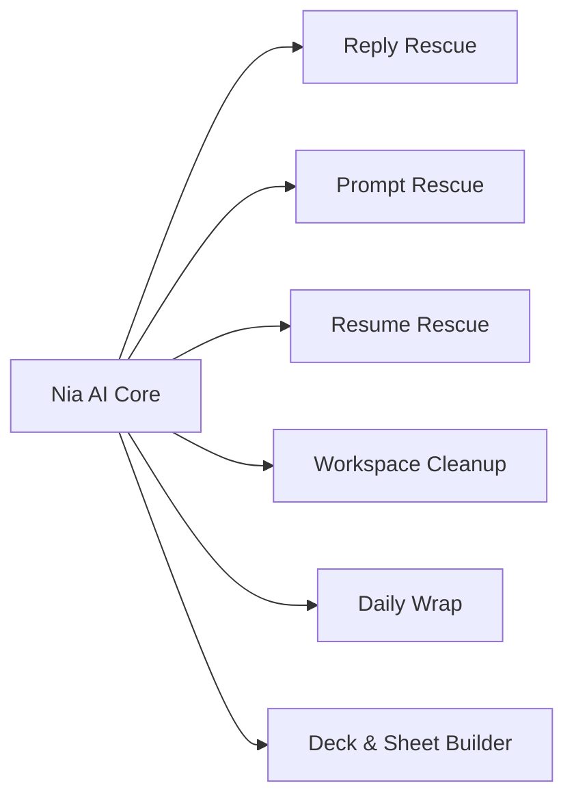

# Implementation Plan: Nia 3D AI Companion & Personal AI OS

## Overview
Transforming Nia from the source VRoid model (`Nia V1 model.vroid`) into a real-time interactive 3D AI companion operating on Windows, incorporating the **10 SOTA VIDA Desktop Companion Use Cases** (`https://vida.app/zh-CN/sotacases/`) and resolving the SSR timeout issue.

---

## 1. Resolved Issues
### SSR Handler Timeout Fix
- **Problem:** `SSR handler timed out after 30s` during initial cold-start module bundling in TanStack Start dev mode.
- **Fix:** Increased the cold-start abort controller timeout in [src/server.ts](file:///d:/Team%20of%20Vishwajeet/src/server.ts) from 30s to 120s.
- **Verification:** Both `http://localhost:8080/` and `http://localhost:8080/console` respond with `HTTP 200 OK`.

---

## 2. Model Audit & VRM Workflow
- **Original Source File:** `C:\Users\vishw\OneDrive\Pictures\Nia V1 model.vroid` (Untouched).
- **Verified Backup:** [Nia V1 model.vroid](file:///d:/Team%20of%20Vishwajeet/Nia/source/Nia%20V1%20model.vroid).
- **Export Destination:** [nia-v1.vrm](file:///d:/Team%20of%20Vishwajeet/public/vrm/nia-v1.vrm) (and `D:\Team of Vishwajeet\Nia\exports\Nia-V1.vrm`).

---

## 3. VIDA SOTA Use Cases Roadmap

1. **回复救星 (Reply Rescue):** Automated conversational contextual replies with tone control.
2. **提示词救星 (Prompt Rescue):** Upgrades rough questions to production-grade prompts.
3. **简历救星 (Resume Rescue):** Formats career context into tailored 98/100 ATS resumes.
4. **工作区整理 (Workspace Cleanup):** Safe duplicate/temp file scan with visual preview and Recycle Bin safety.
5. **每日复盘 (Daily Wrap):** End-of-day task synthesis, achievements, and tomorrow rollover.
6. **投资与市场研究 (Investment & Market Research):** Automated data aggregation into executive briefs.
7. **演示文稿与表格生成 (Deck & Sheet Builder):** Direct `.pptx` and `.xlsx` generation.

---

## 4. Verification Plan
- **Avatar Render Check:** Load 3D model via `@pixiv/three-vrm` in `VRMAvatarViewer`.
- **Animation & Lip-Sync:** Verify randomized eye blinking, Slerp head tracking, viseme mouth animation, and emotion switching.
- **Server Health:** Continuous test on `http://localhost:8080/console`.
