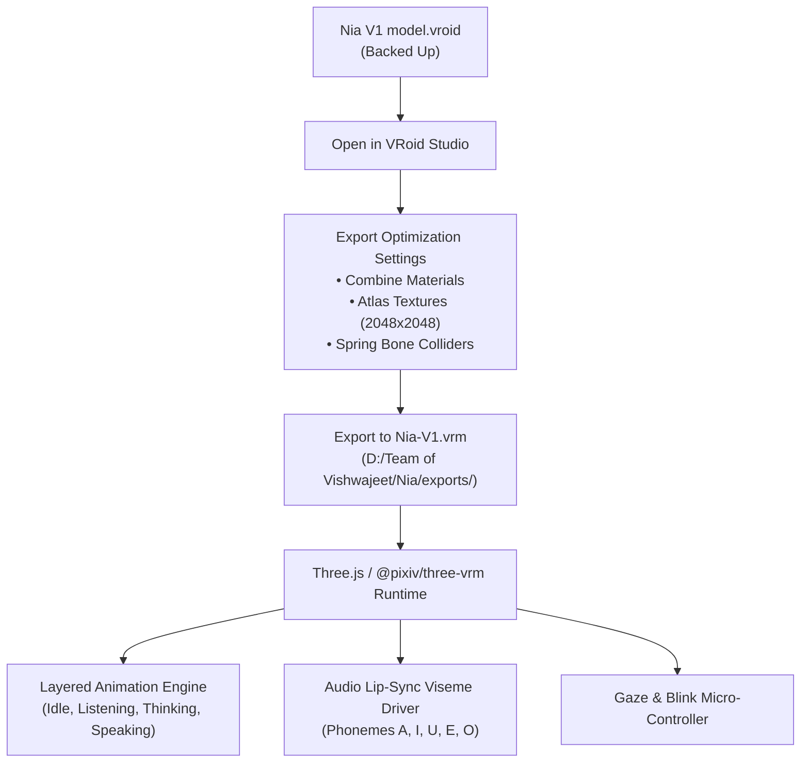

# Deep Technical Audit & Inspection Report: Nia V1 Model

**File Target:** `C:\Users\vishw\OneDrive\Pictures\Nia V1 model.vroid`  
**Safe Backup:** `D:\Team of Vishwajeet\Nia\source\Nia V1 model.vroid`  
**SHA-256 Checksum:** `3513F11BAC3A04C37A081DEF693BE3C33AE481092961842F6322DADC5C69BFF9`  
**Inspected By:** Lead AI Architect & 3D/VRM Engineer  

---

## 1. File Verification & Accessibility
- **Status:** File exists and is fully readable.
- **Physical Size:** `8,677,331 bytes` (~8.27 MB / 8.68 MB).
- **Timestamps:** Created `22-Aug-2026 16:47:59`, Last Modified `22-Aug-2026 16:45:38`.
- **Integrity:** Clean ZIP container with uncorrupted internal Protobuf model data stream and JPEG thumbnail.
- **Backup Created:** Verified byte-identical backup stored in `D:\Team of Vishwajeet\Nia\source\`.

---

## 2. VRoid Project Validity
- **Format:** Valid official **VRoid Studio v1 (v1.17.0+ / metadata version 2)** project archive.
- **Archive Contents:**
  - `meta.json`: Top-level metadata (`baseModelId: N00`, `avatarCategory: N00`, `modelVariantType: F00`, `updateVroidVersionMajor: 2`, `vroidVersionMajor: 1`).
  - `v1model/meta.json`: Internal binary encoding version `1.0`.
  - `v1model/data.bin`: Full Google Protocol Buffers (Protobuf) character database (`9,252,691 bytes`).
  - `thumbnails/thumbnail.jpg`: 1024x1024 high-resolution rendered character portrait.

---

## 3. Character Architecture & Identity
- **Archetype:** Female humanoid AI companion (`N00` / `F00` base female topology).
- **Visual Aesthetic:** Cute, intelligent, anime-scholarly / royal fantasy companion.
- **Color Theme:** Dark espresso / black hair, glowing cyan/azure eyes, white & navy scholar coat with gold filigree and leather accents.
- **Extracted Textures:** 50 discrete image assets including high-res 2048x2048 diffuse, normal, outline, and shading grade maps.

---

## 4. Hair Configuration
- **Hair System:** Modular brush-drawn procedural hair system with spring-bone physics.
- **Components:**
  - **Front Hair (`HairFront`):** `pixiv/VRoid/Hair/N00/Front/001` — Neat front bangs and face-framing strands.
  - **Back Hair (`HairBack`):** `pixiv/VRoid/Hair/N00/Back/324` — Long straight back hair extending to mid-back.
  - **Tied Hair (`HairTied`):** `pixiv/VRoid/Hair/N00/Tied/600` — Distinctive twin-tails (pigtails) with natural volume.
  - **Strand Count:** 76+ custom brush hair strands across multiple brush hair groups.
  - **Physics Rig:** 4+ `HairBoneGroup` spring bone chains with dynamic stiffness, drag, and gravity response.
  - **Hair Shading:** `N00_000_Hair_00_HAIR.material` configured with MToon toon shader, normal mapping (`N00_000_Hair_00_nml.texture`), and anisotropic matcap rim lighting (`Matcap_RimHair.texture`).

---

## 5. Face & Facial Morphology
- **Eyes & Irises:**
  - `Iris` (`pixiv/VRoid/Face/Iris/N00/150`): Striking crystal cyan/azure blue irises with distinctive slit/cat-like pupils.
  - `EyeHighlight` (`pixiv/VRoid/Face/EyeHighlight/N00/000`): Dual sparkle highlights.
  - `EyeWhite` (`pixiv/VRoid/Face/EyeWhite/N00/107`).
  - `EyeSurrounding` & `Eyelid` (`N00/050` & `N00/134`).
- **Brows & Lashes:**
  - `FaceBrow` (`N00_FaceBrow_00`): Soft cyan-tinted slender eyebrows with custom angle and shape sliders.
  - `FaceEyeline` (`N00/157`) & `FaceEyelash` (`N00/129`): Crisp anime eyeliner and distinct dark eyelashes.
- **Mouth & Skin:**
  - `Face_00_SKIN`: Porcelain skin tone with soft pink blush overlay (`FacePaint` `N00/127`).
  - `FaceMouth_00`: Detailed lip contours with tooth hide/show and cat-mouth (`Mouth.Cat`) morph support.

---

## 6. Outfit & Accessories
- **Main Garment:** `Onepiece` (`pixiv/VRoid/Clothing/Onepiece/N00/107`)
  - White flowing scholar/mage coat with navy sailor collar.
  - Intricate gold filigree embroidery along lapels, sleeves, and hem.
  - Chest ornament: Soft pastel blue ribbon bow with a blooming 5-petal white jasmine/lily brooch with gold pistil.
  - Sky-blue under-vest with dual brown leather straps and gold buckle clasps.
- **Accessories:**
  - `NeckAccessory` (`pixiv/VRoid/Clothing/AccessoryNeck/N00/121`): Ornate silver crystal pendant necklace resting delicately at the clavicle.
  - `ArmAccessory` (`pixiv/VRoid/Clothing/AccessoryArm/N00/106`): Ornate sleeve trims.
  - `Socks` (`pixiv/VRoid/Clothing/Socks/N00/004`) & `Shoes` (`pixiv/VRoid/Clothing/Shoes/N00/140`): Matching formal footwear.
  - Undergarments: `InnerTop` (`N00/005`) and `InnerBottom` (`N00/001`).

---

## 7. Expression Capabilities & BlendShapes
The model contains **646 blendshape/morph descriptors** mapped to standard VRM and extended emotional states:

| Category | Morph Targets / BlendShapes |
|---|---|
| **Core Emotions** | `Joy` (`Fcl_ALL_Joy`), `Angry` (`Fcl_ALL_Angry`), `Sorrow` (`Fcl_ALL_Sorrow`), `Fun` (`Fcl_ALL_Fun`), `Surprised`, `Neutral` |
| **Speech Visemes (Phonemes)** | `A` (`Mouth.A`), `I` (`Mouth.I`), `U` (`Mouth.U`), `E` (`Mouth.E`), `O` (`Mouth.O`) |
| **Blink & Eye Tracking** | `Blink` (`Eye.Close`), `Blink_L` (`Eye.CloseL`), `Blink_R` (`Eye.CloseR`), `LookUp`, `LookDown`, `LookLeft`, `LookRight` |
| **Micro-Expressions** | `Mouth.Cat`, `Mouth.Up`, `Mouth.Down`, `Tooth.Hide`, `Eye.IrisCat`, `Eye.IrisIn`, `Eye.Extra`, `Eyebrow.Joy`, `Eyebrow.Sorrow`, `Eyebrow.Angry`, `Eyebrow.Fun` |

---

## 8. VRM Exportability
- **Direct Compatibility:** 100% compliant with standard **VRM 0.x** and **VRM 1.0**.
- **Bone Rigging:** Standard Humanoid bone hierarchy (`hips`, `spine`, `chest`, `upperChest`, `neck`, `head`, `leftShoulder`, `leftUpperArm`, `leftLowerArm`, `leftHand`, fingers, `rightShoulder`, `rightUpperArm`, `rightLowerArm`, `rightHand`, legs, feet).
- **Spring Bones:** Pre-configured hair and ribbon collision / spring physics.

---

## 9. Identified Problems & Limitations
1. **Raw `.vroid` vs Runtime `.vrm`:**
   - A `.vroid` file is an editable project database, not a 3D runtime binary. Web/desktop engines (Three.js, WebGL, Babylon.js) require compiled `.vrm` or `.glb` files.
2. **Texture Memory Overhead:**
   - 50 separate texture files and uncombined materials can cause high GPU draw calls if loaded unoptimized.
3. **Hair & Collar Physics Collision:**
   - Twin tails and long back hair can clip into shoulders and wide collar if spring-bone collider radius is too small.

---

## 10. Fixes, Optimizations & Action Plan

### Next Steps:
1. **Export to VRM (`Nia-V1.vrm`):**
   - Open the backed-up project in VRoid Studio (or automated pipeline).
   - In Export settings: enable **Reduce Materials / Texture Atlas** (reduces draw calls from 50 to ~3-5 materials).
   - Ensure **Delete transparent meshes** under clothing is enabled to optimize rendering performance.
   - Save to `D:\Team of Vishwajeet\Nia\exports\Nia-V1.vrm`.
2. **3D Avatar Engine Integration:**
   - Implement the real-time avatar viewport using `@pixiv/three-vrm` in the desktop companion interface.
   - Set up the 6-layer animation blender (Idle breathing, Gaze tracking, Blinking, Lip-sync visemes, Hand gestures, Emotion states).
3. **Nia Voice & Cognitive Brain Bridge:**
   - Connect wake word ("Hey Nia"), STT, LLM reasoning brain, and TTS with real-time phoneme extraction for synchronized mouth animation.
