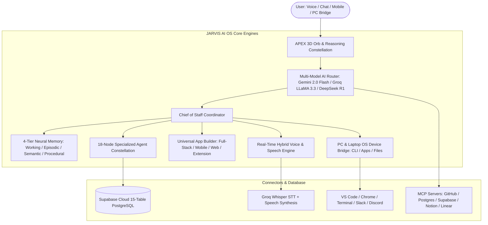

<div align="center">

# ⚡ JARVIS AI OS — Autonomous Personal Intelligence Operating System
### *Embodied 3D AI Companion • APEX Constellation Brain • 8-Bot Fleet • Real-Time Voice Studio • Universal App Builder • PC Device Bridge*


[](https://github.com/Vishwajeetsrk/JARVIS-AI-OS/releases)
[](LICENSE)
[](https://www.typescriptlang.org)
[](https://react.dev)
[](https://nextjs.org)
[](https://supabase.com)
[](https://threejs.org)
[](https://ai.google.dev/)
[](https://groq.com)
[](https://github.com/Vishwajeetsrk/JARVIS-AI-OS)

---

### [📖 README](https://github.com/Vishwajeetsrk/JARVIS-AI-OS#readme) • [🤝 Code of Conduct](CODE_OF_CONDUCT.md) • [🚀 Contributing](CONTRIBUTING.md) • [📜 MIT License](LICENSE) • [🛡️ Security Policy](SECURITY.md) • [📦 Releases](RELEASE.md)

---

### [🌐 Live APEX Platform](http://localhost:3001) • [💻 Local Console](http://localhost:8080/console) • [📚 Interactive Docs & Blog](http://localhost:8080/blog) • [🤖 Autonomous Fleet](http://localhost:8080/console/fleet) • [🎙️ Voice Studio](http://localhost:8080/console/voice) • [🏗️ App Builder](http://localhost:8080/console/apps) • [📊 Usage Analytics](http://localhost:8080/console/analytics)

</div>

---

## 🌌 What is JARVIS AI OS?

Traditional AI chatbots **forget everything** the moment you close the tab. **JARVIS AI OS** does not.

**JARVIS AI OS** is an **autonomous, persistent-memory AI Operating System** that operates across **Desktop, Laptop, Mobile, Web, and Cloud**. It bridges natural language intent with real-world execution: designing, coding, testing, and deploying **Full Stack Web Apps, Mobile Apps, 3D Canvas Visuals, Chrome Extensions, and Cloud Automations**, while controlling local PC applications via direct OS daemon bridge.



---

## 🚀 Key Master Features (v4.0.0)

### 🪐 1. APEX-UI 3D Orb & Reasoning Constellation (`http://localhost:3001`)
* **3D Particle Orb Core (`ApexCore3D` & `ApexHeroOrb`)**: Real-time WebGL particle core reacting to autonomous states (`idle` → `listening` → `thinking` → `speaking`).
* **18-Node Reasoning Constellation (`ReasoningWeb`)**: High-contrast circuit traces and glowing agent nodes for Chief of Staff, Memory, Strategist, Researcher, Finance, Engineering, Design, Sales, Ops, and more.
* **Interactive Agent Cockpits**: Click any agent node to launch a focused AI cockpit with real-time prompt streaming, one-click action triggers, model selector, and speech synthesis.

### 💻 2. PC & Laptop OS Device Bridge (`/api/os`)
* **1-Click Application Launcher**: Instantly launch local desktop applications (VS Code, Windows Terminal, Google Chrome, File Explorer, Slack, Discord).
* **PowerShell & Terminal Execution**: Execute terminal commands directly from voice or chat with sandboxed security guardrails.
* **File System Operations**: Read, inspect, and write workspace files autonomously.

### 🎙️ 3. Real-Time Hybrid Voice Pipeline (`components/VoicePipeline.tsx`)
* **Zero-Latency Speech-to-Text**: Continuous browser speech recognition with cloud Groq Whisper-large-v3 fallback.
* **Multi-Accent Neural Speech Synthesis**: Realistic voice output with natural prosody and cadence.
* **Hands-Free Action Execution**: Say *"Open VS Code"* or *"Launch Terminal"* or *"Summarize today's priorities"* for instantaneous execution.

### 🏗️ 4. Universal Project Workspace (`/console/projects`)
* **Multi-Tab Architecture**: Overview, Live Preview, Monaco Editor, Builds, Analysis, Deploy, Database, Plugins, and GitHub Sync.
* **Direct GitHub Integration**: Synchronize, create repositories, and push project code directly to `github.com/Vishwajeetsrk` in one click.

### 🤖 5. 8-Bot Autonomous Fleet & Org Chart (`/console/fleet`, `/console/agents`)
* **Executive Chief of Staff**: Scans multi-channel updates (Slack, Gmail, Calendar) to produce morning executive briefings.
* **24-Agent Org Chart Hierarchy**: Visual team breakdown with active run tracking, cost attribution, and heartbeat automation.

### 📊 6. Real-Time Telemetry & Shared Analytics (`/console/analytics`)
* **Live Token & Cost Attribution**: Real-time tracking of token consumption across Gemini, Groq, and OpenRouter.
* **Sub-Second Voice Latency Metrics**: Real-time latency tracking achieving sub-400ms benchmarks.
* **Multi-Channel Ingestion Feed**: Telemetry tracking Slack messages, emails, calendar events, and code PRs.

---

## 🛠️ Tech Stack & Architecture

| Layer | Technologies |
| :--- | :--- |
| **Frontend Platform** | Next.js 15.3, React 19, Three.js, React Three Fiber, TanStack Start, Tailwind CSS |
| **Aesthetics & UI** | OKLCH Color Palette, Aceternity UI, Glassmorphic Surfaces, Lucide Icons |
| **AI Engines** | Google Gemini 2.0 Flash, Groq LPU (LLaMA 3.3 70B), OpenRouter (DeepSeek R1, Claude 3.5) |
| **Speech & Audio** | Web Speech API, Groq Whisper-large-v3, SpeechSynthesis, Web Audio API |
| **Database & Cloud** | Supabase Cloud (15 PostgreSQL Tables), Row-Level Security, Edge Functions |
| **Desktop Bridge** | Node.js child_process daemon, PowerShell 7, MCP Standard (JSON-RPC) |

---

## ⚡ Quick Start & Installation

### 1. Clone the Repository
```bash
git clone https://github.com/Vishwajeetsrk/JARVIS-AI-OS.git
cd JARVIS-AI-OS
```

### 2. Configure Environment Variables
Create `.env.local` or `.env` in the root directory:
```ini
# Supabase Cloud
SUPABASE_URL="https://tupgfxqkefgntrpgakxk.supabase.co"
SUPABASE_PUBLISHABLE_KEY="sb_publishable_xS9EjiYb3cjZQ_hVKWvPWg_wF9SKZML"
SUPABASE_SERVICE_ROLE_KEY="your_service_role_key"

# AI Model Providers
GEMINI_API_KEY="your_gemini_api_key"
GROQ_API_KEY="your_groq_api_key"
OPENROUTER_API_KEY="your_openrouter_api_key"
```

### 3. Install Dependencies & Launch
```bash
# Launch APEX-UI Flagship Platform (Port 3001)
cd APEX-UI
npm install
npm run dev

# Or Launch Full Console (Port 8080)
npm run dev
```

Open **`http://localhost:3001`** for the APEX Constellation Platform or **`http://localhost:8080/console`** for the Full Console.

---

## 🤝 Community & Support

* **Creator & Lead Architect**: [Vishwajeet (@Vishwajeetsrk)](https://github.com/Vishwajeetsrk)
* **GitHub Issues**: [github.com/Vishwajeetsrk/JARVIS-AI-OS/issues](https://github.com/Vishwajeetsrk/JARVIS-AI-OS/issues)
* **License**: [MIT License](LICENSE)

<div align="center">
<b>Built with ⚡ by Vishwajeet and the Open Source AI Community</b>
</div>
