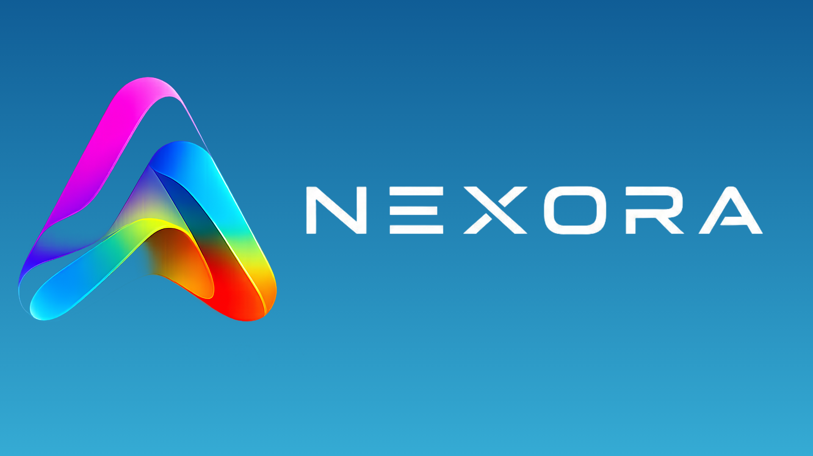

<div align="center">
  

  # ⚡ NEXORA — JARVIS AI OS (v4.0.0 APEX)
  **The Flagship Autonomous AI Operating System for Engineers, Creators & Agencies**

  [](https://nextjs.org/)
  [](https://react.dev/)
  [](https://threejs.org/)
  [](https://supabase.com/)
  [](components/ui/)
  [](docs/architecture/AGENTS.md)
  [](LICENSE)
  [](https://github.com/Vishwajeetsrk)

  <p align="center">
    Architected and maintained by <b>Vishwajeet (<a href="https://github.com/Vishwajeetsrk">@Vishwajeetsrk</a>)</b>.<br/>
    An autonomous AI operating system featuring a <b>3D WebGL particle constellation</b>, an <b>18-specialist agent fleet</b>, a <b>50+ Component UI Studio</b>, a <b>Zero-Fabrication Career OS</b>, an <b>Autonomous Content & Video Studio</b>, a <b>Client Finder & Freelance Agency Command Center</b>, and a <b>Local Windows PC Device Bridge</b>.
  </p>

  [**Live Platform**](http://localhost:3000) •
  [**UI Studio (50+ Components)**](components/ui/) •
  [**Runtime Truth Map**](docs/audit/RUNTIME-TRUTH-MAP.md) •
  [**Architecture Decisions (ADR-001..010)**](docs/architecture/ADR/) •
  [**Contributing**](CONTRIBUTING.md) •
  [**Code of Conduct**](CODE_OF_CONDUCT.md) •
  [**Security Policy**](SECURITY.md) •
  [**MIT License**](LICENSE)
</div>

---

## 🌟 Core Flagship Engines & Capabilities

### 1. 🎨 NEXORA UI Component Studio & Fast Performance Engine (50+ Components)
- **High-Performance Architecture**: 100% `React.lazy` + `Suspense` dynamic code splitting with `IntersectionObserver` viewport gating and isolated `contain: strict` layout caching. Prevents heavy WebGL/Three.js bundles from blocking initial page loads.
- **50+ Pro Interactive Components**: WebGL Shaders (`CloudShader`, `DitherShader`, `AsciiArt`, `WebcamPixelGrid`, `Globe3D`, `Lens`), 3D Hardware Perspectives (`MacbookScroll`, `3DCard`, `3DMarquee`, `CometCard`, `Compare`), Kinetic Typography (`SquigglyText`, `TextFlippingBoard`, `EncryptedText`, `ColourfulText`, `Cover`), Liquid Controls (`GooeyInput`, `Notch`, `MagneticButton`, `StatefulButton`, `Keyboard` with audio click preview), Modals & Carousels (`AppleCardsCarousel`, `AnimatedTestimonials`, `ExpandableCardList`, `ResizableNavbar`, `FloatingDock`), and Ambient FX (`BackgroundBeamsWithCollision`, `BackgroundLines`, `DottedGlowBackground`, `NoiseBackground`, `GoogleGeminiEffect`).
- **Live Interactive Previews**: Full physics-driven, canvas-rendered live demonstration of every component.
- **1-Click Clean Code Copy**: Ready-to-paste TypeScript/Tailwind code with syntax highlighting and 1-click clipboard copy.
- **Live Parameter Customizer**: Real-time sliders and color/text fields for immediate component tweaking.
- **Fullscreen Isolated Canvas**: Test any component in an isolated full-viewport canvas.
- **1-Click Agent Skill Exporter**: Package and register any UI component directly as an Antigravity AI OS skill for autonomous pair programming.

---

### 2. 🧠 3D Particle Constellation & 18-Agent Fleet
- **Interactive 3D WebGL Orb (`ApexCore3D`)**: Hardware-accelerated particle sphere reflecting live agent reasoning states (`idle` → `listening` → `thinking` → `speaking`).
- **18 Specialized AI Personas**: Dedicated agents for **Chief of Staff**, **Developer**, **Engineering Architect**, **GitHub Specialist**, **Operations (DevOps)**, **Salesforce CRM**, **Finance & Cost Guard**, **Sales Outbound**, **Deep Researcher**, **Product Strategist**, **Marketing & Growth**, **Technical Editor**, **Design System**, **Memory Vault**, **Calendar**, **Email Composer**, **Voice Specialist**, and **System Monitor**.
- **Multi-Model Fallback Chain**: Intelligent prompt routing across **Google Gemini 2.5 Flash**, **Anthropic Claude 3.7**, **OpenAI GPT-4o**, **Groq LLaMA 3.3 70B**, and **Local Ollama Intelligence**.

---

### 3. 🎯 JARVIS Career OS 2.0 & AI Role Resume Generator (100/100 ATS)
- **100% Fully Editable Canvas**: Real-time live editing of Identity, Summary, Experience, Projects, Education, Skills, Certifications, and Awards. Add, reorder, delete, and customize every section and bullet point.
- **⚡ AI Role Resume Generator**: Instantly synthesizes 100/100 ATS resumes for any target job role or pasted Job Description (AI Software Engineer, Full Stack Developer, Generative AI Specialist, Frontend Developer, Backend Developer, Data Analyst, SDE-1, Salesforce Operations, or Custom JD).
- **💎 Google XYZ Bullet Formula**: Built-in 1-click optimizer transforming rough bullets into canonical Google standard: *"Accomplished [X] as measured by [Y], by doing [Z]"*.
- **🔍 ATS Keyword Extraction & Injection**: Scans job descriptions in real-time to detect keywords and systematically inject them into relevant skills and experience bullets.
- **📄 Vector SVG Section Icons**: High-definition inline SVG icons that render crisp and cleanly in printed PDFs, Word (`.doc`) exports, and plain text ATS files (supports None, Emoji, or Minimal SVG).
- **🎨 Complete Design System**: Live theme palette (Cyberpunk, Executive, Paper, Minimal, Neon), layout variants, alignment, typography font stacks, bullet styles (`•`, `—`, `→`, `›`), and granular spacing sliders.
- **Multi-Format Export Engine**: 1-click download as Microsoft Word (`.doc`), ATS Plain Text (`.txt`), Markdown (`.md`), JSON, and formatted Print/PDF.
- **Zero-Fabrication Evidence Graph**: Master database validating 100% of user academic marks (BCA SGPA 8.41 / 10), certifications, and production metrics before any resume generation.

---

### 4. 🎬 Autonomous Content, Video & Social Media Studio
- **End-to-End Video Scriptwriting**: Generates 0-3s high-retention viral hooks, core narratives, CTAs, and scene-by-scene audio voiceovers with built-in **1-click speech synthesis preview**.
- **AI Image & Thumbnail Concept Studio**: High-CTR prompt generation engineered for Midjourney, DALL-E 3, and Imagen 3 with badge overlays.
- **Viral SEO & Optimal Posting Time Predictor**: Tailors metadata (titles, ranked hashtags, descriptions) across **YouTube**, **Instagram Reels**, **X/Twitter**, **LinkedIn**, and **TikTok**, predicting peak engagement windows (`6:30 PM - 8:30 PM IST`).
- **Multi-Platform Scheduler & Publisher**: Manages queued social video releases with dates and status badges.
- **Social Analytics & Revenue Dashboard**: Real-time tracking of Views, Likes, Comments, Engagement Rate, and estimated earnings.

---

### 5. 💼 Client Finder & Freelance Agency OS
- **Live Client Discovery Feed**: Curated gigs across **8 core service domains**:
  1. Website Design & Full-Stack Development ($800 – $3,500)
  2. UI/UX & Mobile App Design ($600 – $2,500)
  3. Custom AI Agents & LLM Pipelines ($1,200 – $5,000)
  4. Python Automation & Web Scraping ($400 – $1,800)
  5. Salesforce CRM Data Entry & Reconciliation ($500 – $2,000)
  6. Technical Content Writing & SEO Blogs ($250 – $1,000)
  7. Video Ads & Social Promo Creation ($400 – $1,500)
  8. AI Business Consulting & Roadmaps ($500 – $2,500)
- **1-Click AI Proposal & Pitch Studio**: Automatically drafts winning, hyper-personalized proposals attaching verified project proof (`learnifyai.in`, `github.com/Vishwajeetsrk/JARVIS-AI-OS`, `vishwajeetsrk.github.io`) and structured 3-stage milestones.
- **Client CRM Pipeline (Kanban)**: Visual deal progression across `Prospects` → `Pitch Sent` → `Negotiation` → `Active Project` → `Delivered` → `Paid`.
- **Services Catalog & Rates**: Tiered packages (Starter, Pro, Enterprise) for instant client quoting.
- **Invoices & Revenue Analytics**: Milestone billing with payment gateways (Razorpay, Cashfree, Stripe) and earned revenue tracking.

---

### 6. 💻 Windows PC Device Bridge & Workspace Console
- **1-Click Windows App Launchers**: Visual Studio Code (`code .`), Windows Terminal (`wt`), Google Chrome, File Explorer (`explorer .`), Notepad, and Calculator.
- **Live Hardware & Daemon Telemetry**: Real-time Node runtime (`v24.20.0`), host platform (`win32 x64`), daemon latency.
- **Integrated Workspace Console**: Sandboxed PowerShell command runner with copy output, clear screen, and diagnostic shortcuts (`git status`, `node -v && npm -v`, `ping 8.8.8.8`, `dir`).

---

### 7. 🔌 Connectors & Plugins Manager
- **Unified API Key Vault**: Manage and live-test credentials for **Google Gemini**, **Groq**, **OpenRouter**, **GitHub API**, **Salesforce CRM**, and **Supabase Cloud**.
- **1-Click Live Connectivity Tests**: Real-time latency checks and connection validation.
- **Active Plugin Registry**: Salesforce Reconciler, Git CI Runner, Career OS ATS Engine, and Windows Device Bridge.

---

### 8. 🚀 Verified Workspace Systems & Experience

| System / Experience | Type | Tech Stack | URL / Location | Status |
|---|---|---|---|:---:|
| **JARVIS AI OS** | Core Platform | Next.js 15, React 19, Three.js WebGL, Supabase, Groq | `D:\Team of Vishwajeet` / `localhost:3000` | 🟢 Production |
| **Learnify AI** | EdTech SaaS | Next.js, React 19, Supabase, OpenRouter, Cashfree | [learnifyai.in](https://learnifyai.in) | 🟢 Production |
| **Wardelio Mobile App** | Mobile App | React, Vite, Capacitor (Android & iOS), Tailwind | `C:\Users\vishw\OneDrive\Desktop\Wardelio` | 🟢 Active |
| **DreamSync AI** | Career OS | Next.js, Firebase, Gemini API, Upstash Redis | [vishwajeetsrk.github.io](https://vishwajeetsrk.github.io) | 🟢 Production |
| **Luxury Laundry SaaS** | SaaS Platform | Next.js, Express.js, PostgreSQL, Prisma, Socket.io | [GitHub Repo](https://github.com/Vishwajeetsrk/JARVIS-AI-OS) | 🟢 Ready |
| **Salesforce & Razorpay Reconciler** | Professional Work | Salesforce CRM, Data Loader, Python, Razorpay API | Rootbridge Academy (200k+ Records) | 🟢 Production |

---

## 🏛️ System Architecture

JARVIS AI OS v4.0.0 is structured into **8 decoupled layers** governed by strict contracts:

```
┌──────────────────────────────────────────────────────────┐
│ 1. USER INTERFACE & 3D WEBGL SURFACE (React 19 / Three)  │
├──────────────────────────────────────────────────────────┤
│ 2. APPLICATION SHELL & ROUTER (Next.js 15 App Router)    │
├──────────────────────────────────────────────────────────┤
│ 3. 18-AGENT FLEET & REASONING ENGINES                    │
├──────────────────────────────────────────────────────────┤
│ 4. TASK & EVENT RUNTIME (Task, TaskRun, TaskStep)        │
├──────────────────────────────────────────────────────────┤
│ 5. LEVEL 6 HUMAN APPROVAL GATEWAY & PERMISSIONS          │
├──────────────────────────────────────────────────────────┤
│ 6. UNIFIED TOOL REGISTRY & SANDBOX                       │
├──────────────────────────────────────────────────────────┤
│ 7. EXTERNAL CONNECTORS & PLUGINS (Gemini, Groq, GitHub)  │
├──────────────────────────────────────────────────────────┤
│ 8. PERSISTENCE & VECTOR MEMORY (packages/agent-memory)   │
└──────────────────────────────────────────────────────────┘
```

For full specifications, refer to:
- [`docs/audit/RUNTIME-TRUTH-MAP.md`](docs/audit/RUNTIME-TRUTH-MAP.md)
- [`docs/architecture/PRODUCT-METADATA.md`](docs/architecture/PRODUCT-METADATA.md)
- [`docs/architecture/VERTICAL-SLICE-GITHUB-FLOW.md`](docs/architecture/VERTICAL-SLICE-GITHUB-FLOW.md)
- [`docs/architecture/JARVIS-ARCHITECTURE-V4.md`](docs/architecture/JARVIS-ARCHITECTURE-V4.md)
- [`docs/architecture/DOMAIN-OWNERSHIP.md`](docs/architecture/DOMAIN-OWNERSHIP.md)
- [`docs/architecture/RUNTIME-CONTRACT.md`](docs/architecture/RUNTIME-CONTRACT.md)
- [`docs/architecture/ADR/`](docs/architecture/ADR/)

---

## 📁 Repository Structure

```
.
├── app/                        # Next.js 15 App Router & API routes
│   ├── api/
│   │   ├── chat/               # Multi-model AI router (Gemini, Groq, DeepSeek)
│   │   ├── projects/           # Real verified workspace projects API
│   │   ├── os/                 # Local Windows PC Device Bridge API
│   │   ├── connectors/         # External API keys & connectivity test API
│   │   ├── content/            # Video scripts, SEO metadata & analytics API
│   │   └── agency/             # Client discovery, proposals & invoices API
│   ├── layout.tsx              # Root HTML & font configurations
│   └── page.tsx                # Master 3D viewport & mounted overlay hubs
├── components/                 # React 19 UI & 3D WebGL components
│   ├── ApexWorld.tsx           # Three.js 3D WebGL particle constellation core
│   ├── ApexOverviewPanel.tsx   # Top HUD telemetry, clock, weather & console tile
│   ├── AgentCockpit.tsx        # 18-Agent fleet execution cockpit & chat
│   ├── CareerOS.tsx            # 9-tab Career OS 2.0 & ATS Resume Engine
│   ├── ContentStudio.tsx       # Autonomous Video, Script & Social Media Studio
│   ├── ClientAgencyOS.tsx      # Client Finder & Freelance Agency Command Center
│   ├── ConnectorsManager.tsx   # API Credentials Vault & live connection tester
│   ├── DeviceControlPanel.tsx  # Windows PC Hardware Bridge & app launcher
│   └── ProjectLauncher.tsx     # Workspace Projects Hub & integrated console
├── lib/                        # Core TypeScript business logic & engines
│   ├── career/                 # Evidence graph, 8 resumes, ATS matcher, STAR coach
│   ├── content/                # Video scripts, scene storyboards, SEO optimizer
│   ├── agency/                 # Client gigs, proposal generator, service packages
│   └── version.ts              # Product release metadata source of truth
├── docs/                       # Architectural contracts, ADRs & PRDs
│   ├── architecture/           # Master V4 contracts & ADR-001 through ADR-005
│   └── product/                # PRDs for Projects, PC Bridge, Content Studio, Agency OS
└── supabase/migrations/        # 15 PostgreSQL migrations with pgvector & RLS
```

---

## 🚀 Quick Start Guide

### Prerequisites
- **Node.js**: `v18.0.0` or higher (tested on `v24.20.0`)
- **Git**: Installed and on system `PATH`
- **npm** or **pnpm**

### 1. Clone the Repository
```bash
git clone https://github.com/Vishwajeetsrk/JARVIS-AI-OS.git
cd JARVIS-AI-OS
```

### 2. Install Dependencies
```bash
npm install --legacy-peer-deps
```

### 3. Configure Environment Variables
Create a `.env.local` file in the project root:
```env
# Google Gemini API
GEMINI_API_KEY=your_gemini_api_key_here

# Groq LLaMA 3.3 Engine
GROQ_API_KEY=your_groq_api_key_here

# OpenRouter (DeepSeek R1 / Claude)
OPENROUTER_API_KEY=your_openrouter_api_key_here

# Supabase Cloud Persistence
NEXT_PUBLIC_SUPABASE_URL=your_supabase_project_url
NEXT_PUBLIC_SUPABASE_ANON_KEY=your_supabase_anon_key
SUPABASE_SERVICE_ROLE_KEY=your_service_role_key

# GitHub API Token (Optional)
GITHUB_TOKEN=your_github_personal_access_token
```

### 4. Run Development Server
```bash
npm run dev
```
Open **[http://localhost:3000](http://localhost:3000)** in your browser.

---

## 🔒 Security & Safety Gating

1. **Zero Client Exposure**: All database service role keys, API credentials, and shell execution commands run strictly within server-side route handlers protected by Row-Level Security (RLS).
2. **Level 6 Human Approval Gate**: Destructive actions, job submissions, external email dispatches, and database modifications require explicit user confirmation.
3. **Sandboxed Command Execution**: PC Device Bridge enforces execution bounds, working directory isolation, and syntax validation against root-level destructive commands.

---

## 🤝 Contributing

We welcome contributions from developers, researchers, and designers worldwide!  
Please read our [Contributing Guidelines](CONTRIBUTING.md) and [Code of Conduct](CODE_OF_CONDUCT.md) before opening pull requests.

```bash
# Create feature branch
git checkout -b feat/my-new-feature

# Run TypeScript checks
npx tsc --noEmit

# Commit changes
git commit -m "feat(agent): add autonomous workflow synthesizer"
git push origin feat/my-new-feature
```

---

## 📄 License

This project is licensed under the **MIT License** — see the [LICENSE](LICENSE) file for details.

---

## 👨‍💻 Author & Contact

**Vishwajeet Srk**  
*Full Stack AI Systems Architect & Software Developer*  
- **GitHub**: [@Vishwajeetsrk](https://github.com/Vishwajeetsrk)  
- **Portfolio**: [https://vishwajeetsrk.github.io](https://vishwajeetsrk.github.io)  
- **Email**: [vishwajeetsrk@gmail.com](mailto:vishwajeetsrk@gmail.com)  
- **Location**: Bengaluru, Karnataka, India  

---

<div align="center">
  <sub>Built with ❤️ by Vishwajeet and the Open Source JARVIS AI Community.</sub>
</div>
