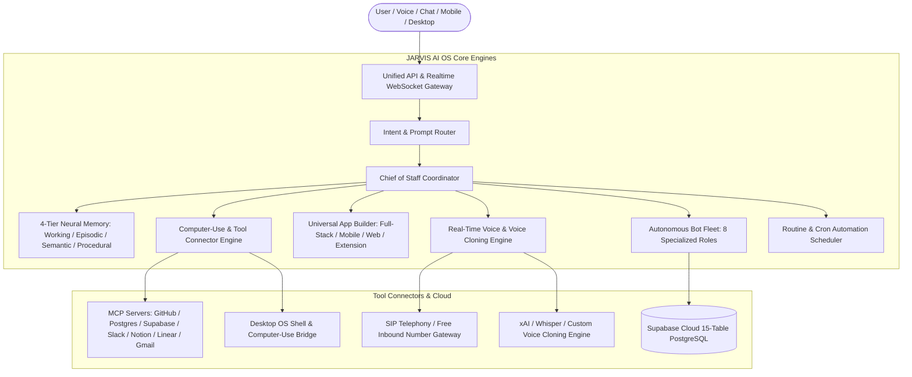
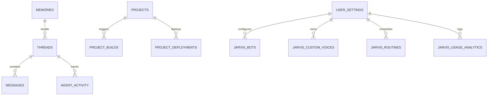

<div align="center">

# ⚡ JARVIS AI OS — Autonomous Personal Intelligence Operating System
### *Embodied 3D AI Companion • 8-Bot Autonomous Fleet • Real-Time Voice Studio • Universal App Builder • Interactive Blog & Docs • 4-Tier Neural Memory*


[](https://github.com/Vishwajeetsrk/JARVIS-AI-OS/releases)
[](LICENSE)
[](https://www.typescriptlang.org)
[](https://react.dev)
[](https://supabase.com)
[](https://threejs.org)
[](https://ai.google.dev/)
[](https://github.com/Vishwajeetsrk/JARVIS-AI-OS)

---

### [🌐 Live Web Console](http://localhost:3000/console) • [📚 Interactive Docs & Blog](http://localhost:3000/blog) • [🤖 Autonomous Bot Fleet](http://localhost:3000/console/fleet) • [🎙️ Voice Studio](http://localhost:3000/console/voice) • [🏗️ App Builder](http://localhost:3000/console/apps) • [📊 Analytics](http://localhost:3000/console/analytics) • [🎨 UI Motion Hub](http://localhost:3000/console/components)

</div>

---

## 🌌 What is JARVIS AI OS?

Traditional AI chatbots **forget everything** the moment you close the tab. **JARVIS AI OS** does not.

**JARVIS AI OS** is an **autonomous, persistent-memory AI Operating System** that operates across **Desktop, Mobile, Web, and Chrome Extensions**. It autonomously designs, codes, tests, and deploys **Full Stack Web Apps, React Native Mobile Apps, 3D Websites, Chrome Extensions (Manifest V3), Autonomous Multi-Agent Graphs, and Scheduled Cloud Automations**.



---

## 🚀 Key Master Features (v3.0.0)

### 🤖 1. Autonomous Bot Fleet & Chief of Staff Hub (`/console/fleet`)
Give each autonomous bot a dedicated job with schedule routines, automated tool execution, and priority escalation:

| Bot Persona | Primary Objective | Key Tools & Integrations | Automated Output |
| :--- | :--- | :--- | :--- |
| **👔 Chief of Staff** | Always-on assistant. Scans Slack, Email, Calendar, and Meeting Notes to surface daily priorities. | Gmail, Google Calendar, Slack, Notion | Morning Executive Briefing, Priority Digest, Thread Follow-up Tracker |
| **🎯 Sales Outbound** | Lead discovery, automated ICP enrichment, and hyper-personalized email sequencing. | Apollo, Clearbit, Gmail, HubSpot | Outbound Campaigns, Prospect List, Warm Lead Alerts |
| **🕵️ Talent Scout** | Sourcing candidate profiles, resume screening, and GitHub challenge evaluation. | LinkedIn, Greenhouse, Resend | Candidate Pipeline Matrix, Scorecards, Offer Letters |
| **📈 Paid Media** | Ad spend optimization and automated budget reallocation across Meta/Google/TikTok ads. | Google Ads API, Meta Marketing API, GA4 | Creative Performance Heatmaps, Daily ROAS Reports |
| **💳 Expense Manager** | Receipt OCR extraction, invoice reconciliation, and SaaS license waste audits. | QuickBooks, Stripe, Bank Plaid API | Monthly P&L Summaries, Budget Threshold Alerts |
| **📊 Product Performance** | Funnel drop-off analytics, feature adoption scores, and churn prediction. | PostHog, Mixpanel, Amplitude, Sentry | Product Health Scores, Churn Risk Alerts |
| **🐛 Bug Reproduction** | Reads Sentry logs, writes automated Playwright repro test scripts, and proposes AST code fixes. | Playwright, Sentry, Monaco Editor | Executable Repro Scripts, Draft Pull Requests |
| **🛡️ Account Health** | Customer retention monitoring, usage spike alerts, and automated QBR deck generation. | Salesforce, Intercom, Vitally | Client Health Dashboard, Executive QBR Slide Decks |

---

### 📚 2. Interactive Documentation & Blog Portal (`/blog`)
An interactive magazine-style documentation hub designed for developers and operators:
* **Instant Category Search**: Real-time filtering across Bot Fleet, Voice Cloning, Universal App Builder, 3D Motion UI, and Cloud Architecture.
* **Embedded Interactive Sandboxes**: Live 3D Earth Globe, 3D Book Flip animation, Voice Waveform latency visualizer, 8-Bot Fleet live counter, and App Scaffold Launcher embedded directly inside articles.
* **1-Click Copyable Code**: Production-grade code blocks with syntax highlighting and 1-click launcher actions into the AI console.

---

### 🎙️ 3. Real-Time Voice Studio & 2-Minute Custom Voice Cloner (`/console/voice`)
* **Sub-Second Latency Speech-to-Speech Engine**: Sub-400ms time-to-first-audio with natural turn-taking and interruption handling.
* **2-Minute Custom Voice Cloning**: Upload a 90–120s reference `.wav` audio sample to clone up to **30 custom voices for free**.
* **Multilingual Timbre Retention (25+ Languages)**: Retains voice timbre, cadence, and warmth across English, Spanish, French, German, Hindi, Japanese, etc.
* **Prosody & Speech Emotion Tags**: Real-time emotion control (`warm`, `authoritative`, `friendly`, `energetic`, `casual`).
* **Direct SIP Telephony & Inbound Calling**: Automated call recording, transcripts, and SOC-2/HIPAA/GDPR compliance guardrails.

---

### 🏗️ 4. Universal Multi-Platform App Builder (`/console/apps`)
1-click autonomous code scaffolding, live Monaco editing, interactive previews, and ZIP exports for:
* **Full-Stack SaaS Apps**: TanStack Start / Next.js + PostgreSQL + Supabase Auth + Stripe Billing.
* **Cross-Platform Mobile Apps**: React Native 0.74 + Expo Router + SQLite offline cache + native sensors.
* **3D Responsive Websites**: Aceternity UI, 3D Canvas Earth Globe, and 3D Book Flip interactive animation.
* **AI Chrome Extensions (Manifest V3)**: Side-panel assistants with DOM content scripts and background service workers.
* **Autonomous AI Agents & Workflows**: Mastra graph definitions with 4-tier neural memory and cron scheduler.

---

### 🎨 5. Interactive UI Components & 3D Motion Hub (`/console/components`)
Browse, inspect, and copy live code, interactive previews, and production prompts for 10+ premium UI components:
* **Interactive 3D Earth Globe**: WebGL Three.js interactive earth with orbital rotation and location pins.
* **3D Book Page Flip Animation**: Smooth CSS 3D transformed interactive book with realistic page turns.
* **Animated Pricing Calculator**: Annual/Monthly discount toggles and real-time tier calculators.
* **Dynamic Testimonial Carousel**: Glassmorphism testimonial cards with animated avatars.
* **Preset Sites & Templates**: 67+ live template previews including CRM panels, Staff Management, and SaaS dashboards with responsive device toggles (Desktop, Tablet, Mobile).

---

### 📊 6. Shared Usage Analytics & Cost Attribution (`/console/analytics`)
* **Real-time Cost & Token Efficiency**: Granular tracking across Gemini 2.0 Flash, Groq LLaMA 3.3 70B, and OpenRouter.
* **Bot Workload Attribution**: Visual token breakdown and budget utilization per bot persona.
* **Multi-Channel Ingestion Telemetry**: Live counters for processed Slack messages, emails, calendar events, and PRs.
* **Self-Healing Error Metrics**: 99.4% task success rate with autonomous AST exception self-healing.

---

### 🌸 7. 3D Embodied Desktop Companion (Nia/Nai VRM 1.0)
* **True 3D Embodiment**: Powered by Three.js & `@pixiv/three-vrm` with secondary physics for hair and cloth.
* **Audio-Driven Phonetic Visemes**: Mouth modulates in real time to phonetic vowels (`aa`, `ih`, `ou`, `ee`, `oh`) during speech.
* **Eye & Head Tracking**: Avatar smoothly tracks cursor movement with Slerp rotation interpolation.
* **Desktop Freedom-to-Walk**: Roams across screen boundaries, sits, waves, and works alongside you.

---

## 🛠️ VIDA SOTA Autonomous Tool Suite

JARVIS AI OS embeds 7 calibrated, type-safe agent tools directly on the dashboard:

| Tool | Capability | Features |
| :--- | :--- | :--- |
| 💬 **Reply Rescue** | Contextual Message Responder | 6 calibrated tones (*Professional, Friendly, Concise, Persuasive, Apologetic, Direct*), editable output, 1-click clipboard copy. |
| 🪄 **Prompt Rescue** | Production Prompt Optimizer | Structured objective, context, constraints, assumptions, recommended role, and formatted output prompt. |
| 📄 **Resume Rescue** | ATS-Optimized Career Builder | Generates keyword-aligned resume highlights without fabricating credentials; supports `.md` download. |
| 🧹 **Workspace Cleanup** | Non-Destructive Janitor | Scope-restricted scanning for duplicates, stale installers, and temp logs. Features dry-run mode and Windows Recycle Bin safety. |
| 📅 **Daily Wrap** | End-of-Day Synthesis | Distinguishes verified accomplishments, in-progress items, blockers, and tomorrow's top priorities. |
| 📈 **Market Research** | Intelligence Briefing | Distinguishes verified facts, estimates, assumptions, and risks with labeled citations and non-financial advice disclaimers. |
| 📊 **Deck & Sheet Builder** | 1-Click PPTX & XLSX Export | Generates 16:9 dark-mode executive slide decks (`pptxgenjs`) and audit datasets (`exceljs`) ready for download. |

---

## 🗄️ Supabase Cloud Database Architecture (15 Active Tables)

JARVIS AI OS connects directly to Supabase Cloud (`ap-south-1` Mumbai) without requiring local Docker Desktop:



| Table Name | Description | Key Columns |
| :--- | :--- | :--- |
| `threads` | AI conversations & sessions | `id`, `user_id`, `title`, `model`, `created_at` |
| `messages` | Chat messages & code blocks | `id`, `thread_id`, `role`, `content`, `tokens` |
| `projects` | User app projects & workspaces | `id`, `name`, `template`, `file_tree`, `status` |
| `connections` | OAuth credentials (GitHub/Slack/Notion) | `id`, `provider`, `access_token`, `scopes` |
| `user_settings` | System prompts, model choices & preferences | `id`, `user_id`, `theme`, `default_model` |
| `cron_jobs` | Scheduled background automations | `id`, `name`, `schedule`, `bot_role`, `enabled` |
| `agents` & `agent_activity` | Autonomous agent execution logs | `id`, `agent_type`, `step_count`, `duration_ms` |
| `memories` | 4-tier vector memory engine | `id`, `tier`, `embedding`, `content`, `relevance` |
| `project_builds` & `project_deployments` | CI/CD build history & preview URLs | `id`, `project_id`, `commit_sha`, `deploy_url` |
| `jarvis_bots` | 8 autonomous bot fleet profiles | `id`, `role`, `status`, `tasks_completed` |
| `jarvis_custom_voices` | 30 custom cloned voice profiles | `id`, `voice_id`, `name`, `sample_url`, `language` |
| `jarvis_routines` | Chief of Staff scheduled daily routines | `id`, `routine_name`, `frequency`, `last_run` |
| `jarvis_usage_analytics` | Token usage & cost telemetry | `id`, `model`, `prompt_tokens`, `cost_usd` |

---

## 🔒 3-Tier Security & Permission Architecture

* **Level 1 (Low Risk - Immediate):** Web search, open URL, draft document, generate code, summarize text.
* **Level 2 (Medium Risk - Ask Before Action):** Read local file, create file, copy file, move file, open desktop application.
* **Level 3 (High/Destructive Risk - Explicit Confirmation Required):** Delete file (always staged to Recycle Bin), run shell script, modify system settings, send communications.

---

## 🚀 Getting Started

### Prerequisites
* **Node.js** v20+ or v24+
* **Windows 11 / 10**, **macOS**, or **Linux**

### 1. Installation

```bash
# Clone the repository
git clone https://github.com/Vishwajeetsrk/JARVIS-AI-OS.git
cd JARVIS-AI-OS

# Install dependencies
npm install
```

### 2. Configure Environment

Copy `.env.example` to `.env`:

```bash
cp .env.example .env
```

Your `.env` file comes pre-configured for Supabase Cloud and Free AI engines (Gemini 2.0 Flash & Groq):

```env
# Supabase Cloud Database (Live Pre-Configured)
SUPABASE_URL="https://tupgfxqkefgntrpgakxk.supabase.co"
SUPABASE_PUBLISHABLE_KEY="sb_publishable_xS9EjiYb3cjZQ_hVKWvPWg_wF9SKZML"

# Free Primary AI Engines
GEMINI_API_KEY="your-gemini-key"
GROQ_API_KEY="your-groq-key"

PORT=3000
```

### 3. Launch JARVIS AI OS

```bash
# Start local development server
npm run dev
```

Visit **`http://localhost:3000`** in your browser to access the full operating system!

---

## 📱 Cross-Platform Builds (Desktop & Mobile)

### Desktop App (Tauri + Rust)
```bash
npm run tauri:dev    # Live development mode
npm run tauri:build  # Compiles Windows .msi / .exe, macOS .dmg, Linux .deb
```

### Mobile App (Android APK & iOS)
```bash
# Build Android APK / Bundle
npx tauri android build

# Build iOS App Bundle
npx tauri ios build -- --device
```

---

## 📁 Repository Structure

```
├── cli/                         # JARVIS Command Line Interface
├── data/                        # Preset template definitions & local JSON stores
├── public/                      # Static assets, VRM models, hero graphics
├── scripts/                     # Python desktop daemons & migration scripts
├── src/
│   ├── components/              # 3D Avatar, UI Motion components, Monaco Studio
│   │   ├── jarvis/              # Command bar, Code editor, Desktop companion, Nav
│   │   ├── tools/               # VIDA 7 SOTA autonomous tool suite
│   │   └── ui/                  # 3D Earth Globe, Book Flip, Aceternity UI
│   ├── integrations/            # Supabase Cloud client & auth middleware
│   ├── lib/                     # Bot fleet, Voice cloner, App builder, Analytics
│   ├── mastra/                  # Autonomous agent graphs & memory workflows
│   └── routes/                  # TanStack Start file-based routing
│       ├── blog.tsx             # Interactive Documentation & Blog Hub
│       ├── index.tsx            # Aceternity Master Landing Page
│       └── _authenticated/
│           └── console/         # Fleet, Voice, Apps, Analytics, Components hubs
├── supabase/                    # 14 PostgreSQL database migrations & RLS policies
└── package.json
```

---

## 🤝 Contributing

Contributions, issues, and feature requests are welcome! Feel free to check the [issues page](https://github.com/Vishwajeetsrk/JARVIS-AI-OS/issues).

## 📄 License

This project is licensed under the MIT License — see the [LICENSE](LICENSE) file for details.

---

<div align="center">
Made with ❤️ by <a href="https://github.com/Vishwajeetsrk">Vishwajeet</a> and the Open Source JARVIS AI Community.
</div>
