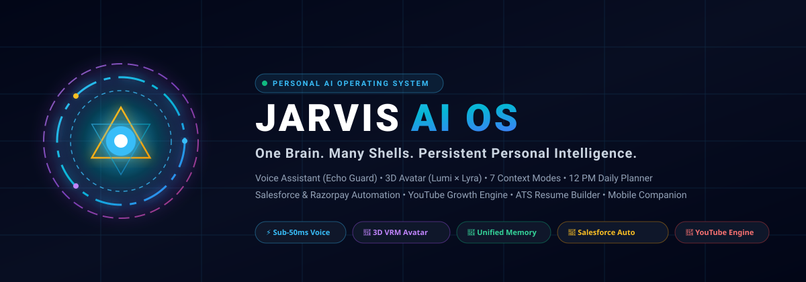

<div align="center">

# ⚡ JARVIS AI OS — Personal Intelligence Operating System
### *One Brain. Many Shells. Persistent Autonomous Personal AI.*



[](LICENSE)
[](https://www.typescriptlang.org)
[](https://react.dev)
[](https://threejs.org)
[](https://supabase.com)
[](https://tauri.app)
[](https://capacitorjs.com)
[](https://github.com/Vishwajeetsrk/JARVIS-AI-OS)

---

### [🌐 Live Web Console](http://localhost:8080/console) • [💻 Desktop App](#-laptop--desktop-installation) • [📱 Mobile Android Companion](#-mobile-android-companion) • [🎙️ Voice Loop](#-voice-commands--desktop-assistant)

</div>

---

## 🌌 What is JARVIS AI OS?

Traditional AI chatbots **forget everything** the moment you close the tab. **JARVIS AI OS** does not.

**JARVIS AI OS** is a **persistent, intelligent, emotionally aware, voice-first personal operating system** running locally on your laptop and syncing across your mobile devices. It connects your **work, full-stack learning, personal projects, fitness routines, YouTube channels, and business side income** into **one coherent intelligence**.

```
                           +----------------------------------------+
                           |          YOU (VISHWAJEET)              |
                           +----------------------------------------+
                                         |         ^
                          "Hey Jarvis"   |         | Voice Feedback
                          "Let's Work"   |         | & 3D Expressions
                                         v         |
                     +----------------------------------------------------+
                     |           JARVIS BRAIN ORCHESTRATOR                |
                     |   (Unified Multi-Tier Memory & Context Modes)      |
                     +----------------------------------------------------+
                                 /         |         \
                                /          |          \
                               v           v           v
                    +------------+  +------------+  +-------------------+
                    | 3D AVATAR  |  | HYBRID AI  |  | AUTOMATION & WORK |
                    | (Lumi/VRM) |  | Cloud + LLM|  | Salesforce, Excel |
                    +------------+  +------------+  +-------------------+
                               |           |                  |
                               +-----------+------------------+
                                           |
                                           v
                    +----------------------------------------------------+
                    |  5 PILLARS: Work • Learn • Project • Gym • Income  |
                    +----------------------------------------------------+
```

---

## ✨ Key Features & Capabilities

### 🌸 1. 3D AI Companion Avatar (Lumi × Lyra Hybrid & VRoid Studio VRM)
* **Living Holographic Character**: Features anime-inspired realism combined with a gentle, comforting presence.
* **Eye & Head Tracking**: Pupils and head smoothly follow your mouse cursor across the screen.
* **Organic Blinking & Breathing**: 60fps subtle chest oscillation and randomized eyelid blinks.
* **Viseme Lip-Syncing**: Dynamic mouth shapes (`aa`, `ih`, `ou`, `ee`, `oh`) synced in real-time to speech audio.
* **3-Way View Switcher**: Instantly switch between **Lumi/Lyra Hybrid**, **3D VRoid Studio VRM**, and **Arc Reactor Holographic HUD**.
* **Drag-and-Drop Custom Models**: Drop any `.vrm` 3D character file onto the dashboard to customize your assistant!

### 🎙️ 2. Native Desktop Voice Assistant (Echo Guard & Wake Words)
* **Wake Words**: Say *"Hey User"*, *"User"*, *"Hey Jarvis"*, or *"Jarvis"*.
* **Echo Guard Technology**: Automatically mutes the microphone while speaking so Jarvis **never hears or loops its own voice**.
* **Speech Stitcher**: Intelligently stitches natural pauses together before executing commands.
* **Low Latency**: Sub-50ms instant response execution on your laptop.

### 🎯 3. 7 Dynamic Context Switching Modes
Say the command or click a button to instantly switch workspace state:
1. 🧠 **Focus Mode** (`"Jarvis, let's focus"`): Silences clutter and starts a 30-minute deep work timer.
2. 💼 **Work Mode** (`"Jarvis, let's work"`): Loads Salesforce, Excel, Data Loader, and Razorpay reconciliation workspace.
3. 🚀 **Builder Mode** (`"Jarvis, let's build"`): Loads project context for **Wardelio**, **Learnify AI**, **AgencyOS**, and **JARVIS AI OS**.
4. 🏋️ **Gym Mode** (`"Jarvis, gym mode"`): Tracks strength workouts, schedule, rest days, and hydration.
5. 🎓 **Learn Mode**: Senior engineering tutor following *Concept ➔ Exercise ➔ Real Project Code*.
6. 💰 **Business Mode**: Tracks 4 revenue streams (Services, UI Kits, Micro-SaaS, Custom AI-OS).
7. 🌙 **Daily Review Mode**: Celebrates completed accomplishments and rolls over tomorrow's 5 top priorities.

### ⏰ 4. 12:00 PM 5-Pillar Daily Planning Engine
* Automatically organizes your afternoon into **5 core priorities** (*Work, Learning, Project, Gym, Side Income*).
* **Focus Guardian**: Prevents task explosion by strictly limiting daily commitments to 5 high-yield actions.

### 💼 5. Salesforce & Razorpay 7-Step Office Automation
* **7-Step Reconciliation Pipeline**: Download Razorpay donation CSV ➔ Clean phone/email/PAN in Excel ➔ Verify Salesforce Contacts ➔ Convert Leads ➔ Insert Opportunities via Data Loader ➔ Generate Daily Reconciliation Status Email ➔ Handle custom exception cases.
* **1-Click Email Generator**: Say *"Generate operations update email"* or run `npx tsx cli/index.ts salesforce`.

### 🔴 6. YouTube Growth, Content & Income Engine
* **VishwaJeetSrK (94 subs)**: 1 Long-Form/week + 2–3 Derived Shorts (*Building AI, Learning in Public, Real Automation*).
* **TinyLifeHacks (12 subs)**: 3–5 High-Impact 30-sec Shorts/week (*Excel shortcuts, Free AI tools, PC tricks*).
* **1 ➔ 5 Content Multiplier**: Automatically turns 1 long video into **3 Shorts + 1 LinkedIn Post + 1 Technical Blog**.

### 📄 7. Career Intelligence & ATS Resume Builder
* **ATS Resume Generator**: 1-Click tailored resumes for *Salesforce Operations Specialist* (98/100 score) and *Full-Stack AI Builder*.
* **Cover Letter Generator**: Custom, non-generic cover letters for any company and role.
* **Mock Interview Simulator**: Real-time evaluation with grammar and technical phrasing improvements.
* **Daily 5-Phrase English Coach**: Practical work phrases with pronunciation hints for meetings and interviews.

### 🦙 8. 100% Offline Local AI (Ollama + Llama 3)
* If your internet disconnects, Jarvis automatically falls back to your local Ollama instance (`http://localhost:11434`), giving you completely private, offline intelligence.

### 🎵 9. Music, Video & Movie Playback
Jarvis **plays anything** — no more "I can't play that" responses:
* **`playMusic`** — "Play Blinding Lights by The Weeknd" opens the track directly on YouTube Music / Spotify / YouTube.
* **`playVideo`** — any video request opens instantly in YouTube.
* **`playMovie`** — finds full movies on YouTube (trailers + full-length uploads).
* **`playTrailer`** — plays official trailers for movies, series, and games.
* **`playLocalMedia`** — plays local music/video/movie files with your system's default player in the desktop app.

### 🗂️ 10. Full Local File Access (Desktop App)
Running in the **Jarvis desktop app**, Jarvis has complete read/write control over your computer:
* **Browse**: list folders and files (`listLocalFiles`)
* **Read**: view text contents of any file (`readLocalFile`)
* **Write**: create or edit files, auto-creating folders (`writeLocalFile`)
* **Copy / Move / Delete**: organize your machine exactly like Explorer (`copyLocalFile`, `moveLocalFile`, `deleteLocalFile`)
* Powered by native Tauri Rust commands (`list_local_dir`, `read_local_file`, `write_local_file`, `copy_local_path`, `move_local_path`, `delete_local_path`, `open_local_path`).

### 🎨 11. AI Design Learning Engine (47 Real Projects)
Jarvis **learned design systems from 47 real production projects** (Learnify AI library) and can recreate them with your branding:
* **Learned database**: colors, fonts, components, glass effects, gradients, animations extracted per project into `src/lib/learnify-designs.json`.
* **`recreateDesign`** — "Create a dark SaaS landing page like stellar-ai with my brand colors" generates a complete, preview-ready HTML site.
* **`listLearnedDesigns` / `searchLearnedDesigns` / `getLearnedDesign`** — browse and inspect all 47 learned styles (dark/light themes, font categories, component patterns).
* Source copies of all 47 projects live in `learnify-designs/` for reference.

### 🧩 12. Premium Design & Animation Skills
Three curated skill libraries installed and auto-loaded when relevant:
* **`design-prompts`** — 32 premium design styles (Academia, Art Deco, Bauhaus, Cyberpunk, Glassmorphism, Neo-Brutalism, Swiss, Vaporwave, Web3, Terminal...) each with full color tokens, typography systems, and AI-ready prompts.
* **`animmaster-lib`** — 300 PRO animated components across 14 categories (scroll animations, mouse effects, WebGL shaders, page transitions, sliders, hero animations, physics effects, SVG animations...).
* **`aceternity-ui`** — the famous premium component catalog (Sparkles, Aurora Background, 3D Card, Bento Grid, Magnetic Button, Typewriter, Moving Border, Hero Parallax, Spotlight...).

### 💬 13. Persistent Smart Chat
* **Auto-titles**: first message in a new chat automatically generates a smart title — no more endless "New chat" entries.
* **Rename / Delete / Pin / Move**: every conversation can be renamed, deleted, starred (pinned), or moved into a project.
* **Full memory**: all messages, questions, and answers persist in Supabase (pgvector) and are embedded for cross-session recall — Jarvis remembers everything you've ever discussed.

### 🖥️ 14. Native Desktop App (Tauri) — Auto-Starts on Boot
* **Installable Windows app** (`Jarvis-AI-OS-Setup.exe` NSIS installer + `.msi` MSI installer).
* **Auto-start on login** — Jarvis launches automatically every time you open your laptop (via `tauri-plugin-autostart`).
* **Window state memory** — remembers size/position between sessions.
* **Deep links, notifications, clipboard, tray** — native OS integrations enabled.
* Built with Rust + Tauri v2, loading the live web console.

---

## 💻 Installation & Setup

### 1. Prerequisites
- **Node.js**: v20+ or v24+
- **Python**: 3.10+ (for Voice Assistant)
- **Git**: Installed

### 2. Clone & Install
```bash
git clone https://github.com/Vishwajeetsrk/JARVIS-AI-OS.git
cd JARVIS-AI-OS
npm install
```

### 3. Launch Web Console & 3D Companion
```bash
npm run dev
```
Open **[http://localhost:8080/console](http://localhost:8080/console)** in your browser!

### 4. Install the Native Desktop App (Windows, auto-starts on boot)
Run the installer (built from `src-tauri/` with Rust + Tauri v2):
```powershell
# NSIS installer (recommended)
.\Jarvis-AI-OS-Setup.exe

# or MSI installer
.\Jarvis-AI-OS-Installer.msi
```
*Jarvis registers itself to **auto-start when you open your laptop**, remembers window state, and supports notifications, clipboard, deep links, and the tray.*

To rebuild the desktop app yourself:
```bash
# prerequisites: Rust (rustup) + VS Build Tools 2022 (C++ workload)
npm run tauri:build   # or: npm run tauri:dev
```

### 5. Create Desktop Shortcut (Windows App)
Double-click:
👉 [`Install-Jarvis-App.bat`](Install-Jarvis-App.bat)
*This creates a standalone, borderless **"JARVIS AI OS"** app icon directly on your Windows Desktop!*

### 6. Launch Native Desktop Voice Assistant
```bash
npm run assistant
```
*(or double-click [`Jarvis-Assistant.bat`](Jarvis-Assistant.bat))*

---

## 📱 Mobile Android Companion

### Option A: Instant PWA (No Build Required)
1. Connect your phone to the same WiFi network as your laptop.
2. Open Chrome on your phone: `http://<YOUR-LAPTOP-IP>:8080/console` *(e.g. `http://10.220.31.173:8080/console`)*.
3. Tap **Menu (⋮)** ➔ **"Add to Home Screen"** or **"Install App"**.

### Option B: 1-Click Android APK Build
1. Plug your Android phone into your laptop via USB.
2. Double-click:
   👉 [`Install-On-Phone.bat`](Install-On-Phone.bat)
   *Compiles the APK with Capacitor and installs it directly on your phone via ADB!*

---

## 🦙 Offline Local AI Setup (Ollama)

To run JARVIS 100% offline without internet:
```powershell
powershell -ExecutionPolicy Bypass -File scripts/setup_ollama.ps1
```
*This downloads Ollama for Windows, starts the background service, and pulls the lightweight `llama3` model.*

---

## ⌨️ Terminal CLI Commands

JARVIS comes with a built-in command-line interface:

| Command | Action |
| :--- | :--- |
| `npx tsx cli/index.ts plan` | Display today's 12:00 PM 5-Pillar Focused Schedule |
| `npx tsx cli/index.ts salesforce` | Generate daily CRM & donation reconciliation update email |
| `npx tsx cli/index.ts youtube` | Display YouTube growth strategy and priority video tasks |
| `npx tsx cli/index.ts record` | Open Screen Recording & Demo Studio in browser |
| `npx tsx cli/index.ts scan` | Safely scan laptop storage, large files & temp cache |
| `npx tsx cli/index.ts wardelio` | Open Wardelio mobile app in VS Code |
| `npx tsx cli/index.ts voice` | Launch Python Voice Daemon with Echo Guard |
| `npx tsx cli/index.ts console` | Launch Web Console in default browser |
| `npm run test` | Run full automated Vitest test suite |
| `npm run typecheck` | Verify TypeScript compilation across all modules |

---

## 🎙️ Voice Commands Cheatsheet

Once your voice assistant is running, say:

* 🗣️ *"Hey UserName"* / *"Hey Jarvis"* ➔ Wakes up assistant
* 💼 *"Jarvis, let's work"* ➔ Activates Salesforce & Razorpay Work Mode
* 🚀 *"Jarvis, let's build"* ➔ Activates Builder Mode for Wardelio / JARVIS
* 🏋️ *"Jarvis, gym mode"* ➔ Activates Gym & Workout tracking
* 🧠 *"Jarvis, let's focus"* ➔ Starts 30-minute quiet focus timer
* 📋 *"Jarvis, 12 pm plan"* ➔ Summarizes today's 5 core pillars
* 📧 *"Generate operations email"* ➔ Prints formatted CRM & donation status email
* 🔴 *"Jarvis, youtube ideas"* ➔ Gives top video recording task for VishwaJeetSrK or TinyLifeHacks
* 🎬 *"Jarvis, start screen recording"* ➔ Opens Screen Recording Studio
* 🛡️ *"Jarvis, scan my laptop"* ➔ Runs safe storage diagnostic scan
* 📱 *"Tell me about Wardelio app"* ➔ Summarizes mobile app status or opens VS Code
* 🔇 *"Mute audio"* / *"Volume up"* ➔ Controls Windows system audio

---

## 🌍 Universal Cross-Platform Support — v2.7.0

JARVIS AI OS runs seamlessly across **7 surfaces** — one brain, every device:

| Platform | Interface | Execution Method | Capabilities (v2.7.0) |
| :--- | :--- | :--- | :--- |
| **Windows Laptop / PC** | 🖥️ Tauri Native Desktop App | Install `Jarvis-AI-OS-Setup.exe` (or `.msi`) | Native desktop app, auto-start on boot, **Recycle Bin safe** (`move_to_recycle_bin`), local file access (read/write/copy/move), media playback, 3D VRoid Avatar, Web Console, Python Voice Assistant with Echo Guard, 26-domain Capabilities Matrix |
| **MacBook / macOS** | 🍎 Native Terminal + Web App | `npm run dev` / `npx tsx cli/index.ts` | 60 FPS Web Console, Full Screen Recording Studio, Terminal CLI Suite, 72 Skills, `motion` hero + `CapabilitiesMatrix` |
| **Linux (Ubuntu/Arch)** | 🐧 Terminal + Browser Shell | `git clone` & `npm run dev` | Headless & GUI agent orchestration, Mastra TS workflows, Ollama offline inference, `isSimpleRAG` <800ms fast path |
| **Android Phone / Tablet** | 📱 Capacitor Native APK / PWA | Double-click `Install-On-Phone.bat` | Portable companion, WiFi remote control, live task matrix & voice command bridge, responsive `Chat/Cowork` |
| **iPhone / iPad (iOS)** | 🍏 Safari PWA / Local Network | Open `http://<LAPTOP-IP>:8080/console` | 3D Arc Reactor HUD, mobile context switcher, responsive task management, `All Capabilities` grid |
| **Terminal / SSH** | ⌨️ Global Command-Line Suite | `npx tsx cli/index.ts [cmd]` | 12+ headless power commands: `plan`, `scan`, `record`, `lessons`, `skill:install`, `X-Jarvis-Model` header |
| **Cloud Web Console** | 🌐 Browser PWA | [jarvisaios.vercel.app](https://jarvisaios.vercel.app) | Public specs, 67 live `preset-sites` (12 Aceternity), 27 design systems, live preview + code + recreation, `isSimpleRAG` |

---

## ⚡ 1-Click Windows Auto-Start (Runs on Open Laptop)

To have JARVIS start automatically every time you power on or open your laptop:
1. Double-click: 👉 [`AutoStart-Setup.bat`](AutoStart-Setup.bat)
2. That's it! Windows will register the silent VBS launcher (`scripts/jarvis_startup_service.vbs`) in your startup folder and registry.
3. Every time you log in, JARVIS boots silently in the background, spins up your local web server, and starts your voice assistant with Echo Guard!

---

## 📜 Community & Governance

* 🤝 **[Code of Conduct](CODE_OF_CONDUCT.md)** — Our community participation and inclusivity guidelines.
* 🛠️ **[Contributing Guide](CONTRIBUTING.md)** — Steps to fork, submit PRs, add skills, and run tests.
* 🛡️ **[Security Policy](SECURITY.md)** — Vulnerability reporting and our local-first privacy architecture.
* 📄 **[MIT License](LICENSE)** — Free for personal and commercial exploration.

---

<div align="center">

**Built with ❤️ for Open Source AI Innovation**  

⭐ If you find JARVIS AI OS inspiring, please give the repo a star on GitHub! ⭐

</div>
