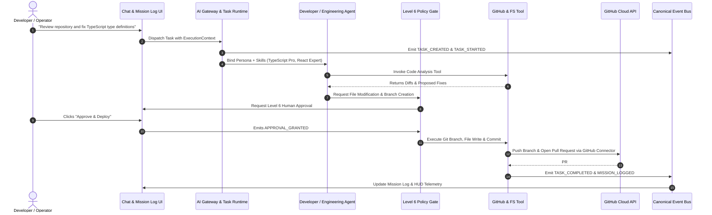

# Canonical Vertical Slice: JARVIS Autonomous GitHub Flow

**Document Version:** 4.0.0  
**Pattern:** End-to-End Reference Architecture  
**Status:** Validated  

---

## 1. Flow Overview

This vertical slice validates the unified coordination of the entire JARVIS AI OS stack:
**AI Gateway + ExecutionContext + Agent + Tool + Connector + Policy Engine + Human Approval Gate + Event Bus + Mission Log**.

---

## 2. Step-by-Step Contract Verification

| Step | Subsystem | Action | Contract Enforced |
|---|---|---|---|
| **1. Intent Capture** | AI Gateway | Parses user intent, selects model (Claude 3.7 / GPT-4o). | `EXECUTION-CONTEXT.md` |
| **2. Task Init** | Task Runtime | Spawns `TaskRun` with ID, token budget, and required tools. | `RUNTIME-CONTRACT.md` |
| **3. Agent Reasoning** | Developer Agent | Inspects TypeScript AST, loads `typescript-pro` skill. | `AGENT-CONTRACT.md` |
| **4. Approval Gate** | Policy Engine | Flags write operations as High Risk; requests human sign-off. | `TOOL-CONTRACT.md` (Level 6) |
| **5. Tool Execution** | GitHub Connector | Pushes code changes and opens PR on `Vishwajeetsrk/JARVIS-AI-OS`. | `CONNECTOR-CONTRACT.md` |
| **6. Event Broadcast** | Event Bus | Broadcasts `TASK_COMPLETED` to Mission Log and 3D visual orb. | `EVENT-CONTRACT.md` |

---

## 3. Reference Implementation Verification
- Connector Health: **GitHub API / Octokit authenticated**
- Policy Gate: **Level 6 Human Approval Gate enforced**
- Mission Log: **Supabase PostgreSQL real-time sync active**
