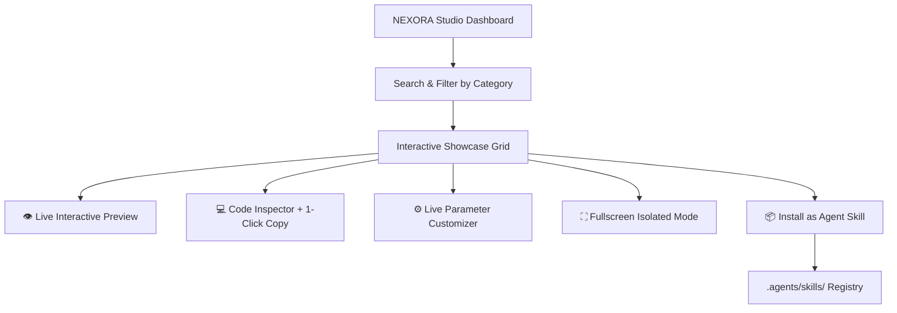

# PRD: NEXORA UI Component Studio & Skill System

**Document Version:** 4.0.0  
**Author:** Vishwajeet Srk  
**Platform:** NEXORA · JARVIS AI OS  
**Status:** Production Ready  

---

## 1. Executive Summary

The **NEXORA UI Component Studio & Skill System** is a unified visual engineering environment and agent skill registry for creating, customizing, previewing, and installing modern interactive UI components.

It bridges reactive UI design, WebGL shader execution, and Antigravity Agent skills, empowering developers to instantly preview components, inspect clean TypeScript/Tailwind code, tweak live parameters, and export/install components into their apps and AI workflows with 1 click.

---

## 2. Architecture & Design Principles



### Core Tenets
1. **Zero External Breakages**: All components are self-contained React 19 / TypeScript modules with no hidden or outdated native binary dependencies.
2. **Real-time Customization**: Live sliders, color pickers, and text modifiers update the rendering pipeline immediately.
3. **Agent Skill Exporter**: Components can be packaged into installable skills for autonomous AI pair programming.
4. **Dark Mode First & Cyberpunk Luxury Aesthetics**: Ultra-high visual polish with neon glows, glassmorphism, and smooth physics.

---

## 3. Component Taxonomy & Inventory (50+ Components)

### 3.1 WebGL, Canvas & Shaders
- **`CloudShader`**: Dynamic volumetric procedural cloud simulation shader.
- **`DitherShader`**: Retro Bayer 4x4 matrix dithering canvas filter.
- **`AsciiArt`**: Real-time image-to-ASCII character matrix.
- **`CanvasText`**: Kinetic typography with canvas scanline and glow trails.
- **`PixelatedCanvas`**: Interactive mouse-repel pixel particle canvas.
- **`WebcamPixelGrid`**: Waveform elevation matrix grid with camera / simulated feeds.
- **`Globe3D`**: 3D interactive vector globe with geographic nodes and orbital rotation.
- **`Lens`**: Optical magnifying glass lens with ray shader background.

### 3.2 Hardware & 3D Cards
- **`MacbookScroll`**: 3D Perspective MacBook hardware mockup with scroll-driven lid angle.
- **`ThreeDCard` (`CardContainer`, `CardBody`, `CardItem`)**: CSS 3D perspective mouse hover depth.
- **`ThreeDMarquee`**: Infinite isometric 3D scrolling component wall.
- **`CometCard`**: Cosmic 3D holographic card with comet light trail.
- **`Compare`**: Split-screen before/after image slider with interactive handle.
- **`DraggableCard`**: Physics-based multi-card draggable playground.

### 3.3 Kinetic Typography
- **`SquigglyText`**: SVG turbulent displacement animated squiggly wiggle text.
- **`TextFlippingBoard`**: Mechanical airport schedule split-flap character flipper board.
- **`EncryptedText`**: Matrix cipher scramble-to-decrypted character stream.
- **`ColourfulText`**: Kinetic iridescent gradient text flow.
- **`Cover`**: Warp-speed highlight banner with animated backdrop.
- **`ContainerTextFlip` / `LayoutTextFlip`**: Smooth 3D word flipping carousel.
- **`TextHoverEffect`**: SVG stroke gradient with mouse spotlight reveal.

### 3.4 Interactive Controls & Inputs
- **`GooeyInput`**: Liquid SVG filter search input with particle focus glow.
- **`Notch`**: Floating dynamic island notch with theme & alignment toggles.
- **`MagneticButton`**: Physics-based magnetic cursor attraction button.
- **`StatefulButton`**: Multi-state action button (Idle → Loading → Success).
- **`FileUpload`**: Drag & drop file uploader with real-time vector indexing tags.
- **`Keyboard`**: Full mechanical 3D keyboard with WebAudio clicks and live preview.
- **`PointerHighlight`**: Collaborative cursor highlight annotations.

### 3.5 Cards, Modals & Navigation
- **`AppleCardsCarousel`**: WWDC style expandable cards with modal dialogues.
- **`AnimatedTestimonials`**: Smooth testimonial cards with 3D avatar stack.
- **`ExpandableCardList`**: List to fullscreen modal expansion cards.
- **`FocusCards`**: Hover blur & zoom focus gallery.
- **`AnimatedModal`**: Interactive modal trigger with 3D hover physics.
- **`TooltipCard`**: Rich profile hover card (Tyler Durden card).
- **`CardSpotlight`**: Radial mouse follower illumination card.
- **`ResizableNavbar`**: Floating glassmorphism navbar with mobile drawer.
- **`FloatingDock`**: macOS magnified interactive dock.
- **`HeroSectionOne`**: High-conversion hero section with glowing grid borders.

### 3.6 Ambient FX & Loaders
- **`BackgroundBeamsWithCollision`**: Laser beams with particle collision sparks.
- **`BackgroundLines`**: Flowing SVG curves with iridescent gradients.
- **`BackgroundRippleEffect`**: Interactive grid box ripple wave on hover/click.
- **`DottedGlowBackground`**: Radial glow pulsing dot grid backdrop.
- **`NoiseBackground`**: Perlin noise texture with dynamic iridescent gradient card.
- **`Scales`**: Precision architectural ruler / crosshair scale grids.
- **`GoogleGeminiEffect`**: Multi-strand generative glowing SVG waves.
- **`TracingBeam`**: Scroll-following neon tracer beam.
- **`StickyBanner`**: Top dismissible announcement banner.
- **`LoaderOne`, `LoaderThree`, `LoaderFour`**: High-performance SVG spinners & indicators.

---

## 4. How to Use & Install Components as Skills

### In React / Next.js Applications:
```tsx
import { CloudShader } from "@/components/ui/cloud-shader";

export default function MyPage() {
  return <CloudShader className="h-96 w-full" speed={1} />;
}
```

### In JARVIS AI OS Agents:
Click **"Install Skill"** on any component in the UI Component Studio to register the component's specification directly into `.agents/skills/`. Autonomous agents can then invoke and generate layouts using these components during pair programming.

---

## 5. Verification & Performance Benchmarks
- **Frame Rate Target:** Stable 60 FPS across all WebGL/Canvas shaders and CSS 3D transforms.
- **Bundle Optimization:** Tree-shakeable, modular exports in `components/ui/`.
- **Responsive Design:** Mobile-first layout with smooth touch handling and accessible keyboard navigation.
